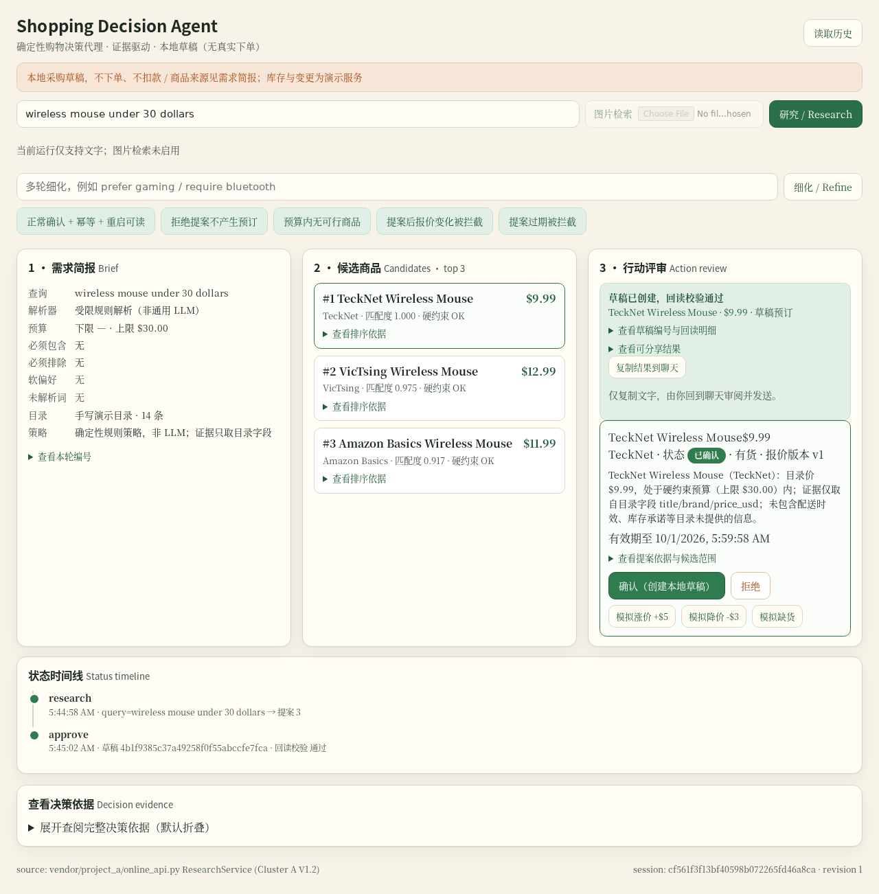

# TraceShop

购物决策与回执小程序。输入需求后，比较候选商品和目录证据；确认后保存采购草稿，读回核对结果，再由用户把回执带回聊天。报价或库存发生变化时，旧提案失效，需要重新研究和确认。

> **初赛作品入口：[SUBMISSION.md](SUBMISSION.md)** — 场景、任务、固定版本、材料链接、验证证据与已知边界。当前材料版本 v0.2.1。

- 队伍：**TraceShop**
- 唯一成员 ID：**TraceShop-Felix**（微信群昵称）
- 赛道：**OctoSense 购物与物流**
- 已加入参赛群

## 运行

需要 Python 3.10 或更新版本，仅使用标准库。Web 核心保持确定性，不发起出站请求。

```bash
git clone --branch v0.2.1 --depth 1 https://github.com/prettygirlisnotme/TraceShop.git
cd TraceShop
python3 -m shop_agent.server
```

打开 <http://127.0.0.1:8088/>。默认使用 14 条自编演示商品，不需要下载模型或商品数据。图片入口在未配置本地模型时禁用。

```bash
python3 -m unittest discover -s tests -v
```

## 工作流

1. 解析文字条件，过滤硬约束，返回三个候选及目录证据。
2. 提案绑定商品、会话版本、报价版本与有效期。
3. 用户确认或拒绝；确认后创建 SQLite 采购草稿，重复确认返回同一草稿。
4. 从数据库独立读回，核对商品、价格和状态。
5. 模拟涨价或缺货，拦截旧提案；重新规划后仍需用户确认。
6. 预览并复制确认回执，由用户回到聊天决定是否发送。



[浏览器演示（约一分钟）](evidence/demo.webm) · [宿主发送卡片](evidence/host-card-sent.png) · [结果回到聊天](evidence/host-result-return.png) · [报价变化](evidence/quote-changed.png)

## 宿主接入

Web 卡片使用 `rs.robius.robrix.mini_app` 消息类型。[消息示例](demo/robrix2-card.example.json)与[复现步骤](docs/REPRODUCING.md)说明如何在兼容宿主打开本机地址。

官网示例链接的历史宿主提交 `05daf9bdb05fafc6d8f04dcb312a35f1d46a661e` 已在 Linux 测试：发送卡片、打开应用、确认草稿、读回、复制，再通过宿主发送回执。浏览器使用透明的 headless URL 打开器适配器；截图和浏览器录像分别提供。11 项标准库检查与 10 项宿主工作流检查通过；v0.2.0 公开检出复验（作业 180053，11 项检查 + HTTP）也通过。v0.2.1 只改 Web 导出与原生审阅包，后端与 `vendor/` 未变，故沿用该单元基线。详见[验证记录](docs/VALIDATION.md)。

## 可选原生 Agent 审阅（v0.2.1）

固定 Rinx（`5a9e2af`）与官方打包的 `octos`（`2.0.3-rc.13`）已在受限测试环境实测：Discover → Mini apps → Import 导入 [`native/agent-review/`](native/agent-review/)（stamped bundle **0.2.1**，BLAKE3 `3051f8f0…`），Review 仅显示 `octos.session.open`、`octos.turn.start`、`octos.turn.interrupt` 且无 room。Run 后由用户手动粘贴 Web 导出的候选/约束/证据/报价版本/有效期；assistant 关闭时显示真实宿主错误，配置本机 provider 后 `session.open` 与 `turn.start` 经真实 Splash 回调返回非空建议，终态标签为“审阅完成（建议未执行）”。证据：[结果](evidence/agent-review-result.png) · [assistant 关闭](evidence/agent-review-off.png) · [导出](evidence/agent-review-export.png) · [浏览器导出检查](evidence/agent-review-browser-checks.json)。

**时间上下文**：v0.2.1 的导出新增 `time_context`。`proposal_created_at_utc` 取服务端已有的提案创建时间（UTC、秒），`current_time_utc` 显式为 `null`——不伪造当前时钟。审阅提示区分**创建时间、截止时间与当前时间**，并说明空数组表示“用户未设置该项”，不是资料缺失。请勿把创建时间或 `expires_at` 当作当前时间。

这是 **standalone Rinx 自己的本地 Agent peer**：不是宿主注入的 OctoSense System Agent，不是 Web URL 卡片的自动 bridge，未经签名或 App Hub 上架。Web 核心保持确定性、默认零出站；只有用户在 Web 明确确认才会写入本地草稿，Agent 建议不会自动批准。模型建议仅为文本，仍可能出错；权威判断是 Web 的确定性有效期与版本检查。v0.2.1 提示修正后，本次实测不再把未过期提案判为已过期，也不再把空数组说成缺失——这是单次用例改善，不等于稳定的模型准确率（见[历史 v0.2.0 误判记录](https://github.com/prettygirlisnotme/TraceShop/blob/v0.2.0/evidence/agent-review-checks.json)）。

宿主与内核二进制需另外准备，不在 TraceShop 源码包中。

## 开发与来源

模块入口、状态约束和下一步见[开发说明](docs/DEVELOPMENT.md)，本地数据与原生外发说明见[PRIVACY.md](PRIVACY.md)。

本项目采用 [Apache-2.0](LICENSE)。`vendor/project_a/` 复用已有购物检索管线，保留原许可证与逐文件校验；宿主协议参考保留 MIT 声明，见 [NOTICE](NOTICE)。真实商品目录和模型权重不在仓库中。
