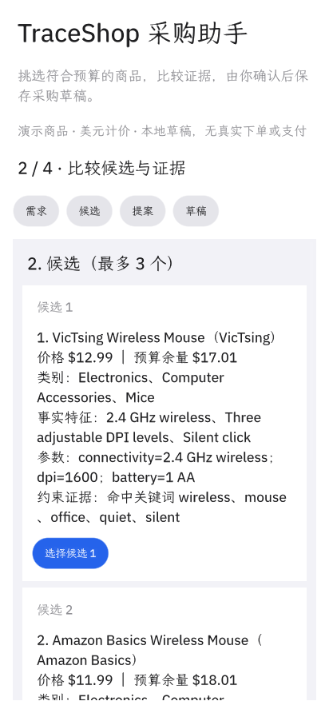

# TraceShop 采购助手

把商品需求变成可确认的采购提案：比较候选与证据，确认后保存采购草稿，再从存储读回核验。

主程序使用 **OctoScript / Splash**，位于 [`bundle/main.splash`](bundle/main.splash)。商品检索、提案状态、用户确认和草稿存储都在脚本应用内完成。

当前应用版本为 **0.4.0**：已在官方 `card-host` 的 Linux 环境实际运行，核心流程已验证；发布者、支持与隐私资料已补齐，**已提交 [App Hub 审核 #71](https://github.com/OctoSense-org/OctoSense-App-Hub/issues/71)，等待维护者审核**。



## 使用

1. 填写需求、美元预算和必须包含的商品词，也可选择办公、游戏或便携预设。
2. 研究商品，比较最多三个候选的价格、特征和约束证据。
3. 选择候选，得到待确认提案；可请求宿主 Agent 审阅。
4. 明确确认后保存采购草稿，查看独立读回的结果。

模拟报价变化后，旧提案不能确认。需求或约束改变后须重新研究；拒绝提案不会创建新草稿。已保存的草稿可以在应用重启后恢复。

目录包含 **14 条合成演示商品，价格单位为 USD**。保存的是本地采购草稿，应用没有真实支付、下单或物流服务。

## 运行

先按 [官方开发流程](https://github.com/OctoSense-org/OctoScript-App-Design-Flow/blob/main/README.zh-CN.md) 准备 `hub`、`card-host` 和 `tools/octo`。在该流程工作区运行：

```bash
tools/octo run /path/to/TraceShop/bundle --port 8141 --hidden --detach
```

`--hidden` 用于开发时后台操作；需要可见窗口时去掉它。应用数据由宿主放在自身分配的私有目录中。

官方 `card-host` 当前不提供 `octos` 审阅服务，应用会显示真实的服务不可用提示；手动选择、确认和存储仍可使用。支持这些服务的宿主可以返回模型建议；本版已在固定 Rinx / octos / MiniMax-M3 下完成一条真实建议采纳、人工确认与存储读回流程；[实测证据](evidence/native-agent-workflow.json)。OctoSense 桌面 Shell 和手机尚未验证。

## 演示与验证

- [原生购物操作录屏](evidence/native-shopping.webm)
- [重启恢复录屏](evidence/native-restart.webm)
- [真实 Agent 回复与采纳截图](evidence/native-agent-review.png) · [采纳状态](evidence/native-agent-adoption.png) · [保存结果](evidence/native-agent-draft.png)
- [验证范围与固定宿主版本](docs/VALIDATION.md)
- [官方包检查输出](evidence/native-hub-check.txt)
- [初赛材料入口](SUBMISSION.md)

录屏由官方宿主的连续原生窗口帧采样后以 4fps 编码，播放速度与现场操作时间不同。

## 代码入口

| 入口 | 职责 |
| --- | --- |
| `research` | 预算与商品词过滤、候选事实与证据 |
| `pick` | 生成待确认提案 |
| `confirm_draft` | 核对需求、报价和有效期，写入并独立读回 |
| `request_review` / `adopt_suggestion` | 请求宿主审阅，核对建议来源，保持人工确认 |
| `boot` | 恢复已保存的草稿 |

应用包只申请存储和三个 `octos` 宿主服务，不持有模型密钥。主动请求审阅时，需求和候选资料可能经宿主发送到其配置的模型服务。

既有网页原型和辅助审阅器的历史发布见 [v0.3.0](https://github.com/prettygirlisnotme/TraceShop/releases/tag/v0.3.0)。当前应用入口是 `bundle/`。

发布者：TraceShop-Felix。支持：[GitHub Issues](https://github.com/prettygirlisnotme/TraceShop/issues)；[隐私说明](PRIVACY.md)。

许可证：[Apache-2.0](LICENSE)。
