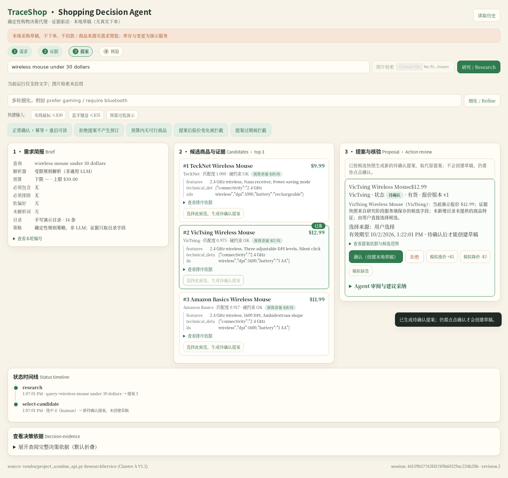

# TraceShop

购物决策与回执小程序。输入需求后，比较候选商品和目录证据；确认后保存采购草稿，读回核对结果，再由用户把回执带回聊天。报价或库存发生变化时，旧提案失效，需要重新研究和确认。

> **初赛作品入口：[SUBMISSION.md](SUBMISSION.md)** — 场景、任务、固定版本、材料链接、验证证据与已知边界。当前材料版本 **v0.3.0**，候选选择与真实 Agent 建议采纳已实测。

- 队伍：**TraceShop**
- 唯一成员 ID：**TraceShop-Felix**（微信群昵称）
- 赛道：**OctoSense 购物与物流**
- 已加入参赛群

## 运行

需要 Python 3.10 或更新版本，仅使用标准库。Web 核心保持确定性，不发起出站请求。

```bash
git clone --branch v0.3.0 --depth 1 https://github.com/prettygirlisnotme/TraceShop.git
cd TraceShop
python3 -m shop_agent.server
```

打开 <http://127.0.0.1:8088/>。默认使用 14 条自编演示商品，不需要下载模型或商品数据。图片入口在未配置本地模型时禁用。

```bash
python3 -m unittest discover -s tests -v
```

## 工作流

1. 解析文字条件，过滤硬约束，返回三个候选及目录证据。
2. 直接选中候选，或把候选资料交给可选的本地 Agent 审阅、粘贴其固定字段 JSON，生成新的待确认提案。
3. 新提案绑定服务端候选快照、会话 revision、报价版本、白名单、截止时间与当前报价/库存；切换时递增 revision、旧提案标为 SUPERSEDED，并保留原截止时间。
4. 用户确认或拒绝；确认后创建 SQLite 采购草稿，重复确认返回同一草稿。生成提案本身不创建草稿。
5. 从数据库独立读回，核对商品、价格和状态。
6. 模拟涨价或缺货，拦截旧提案；重新规划后仍需用户确认。
7. 预览并复制确认回执，由用户回到聊天决定是否发送。

## 演示素材



[真实 Agent 采纳演示](evidence/agent-workflow.webm) · [候选选择](evidence/candidate-selected.png) · [建议采纳](evidence/agent-adopted.png) · [核验结果](evidence/workflow-verified.png) · [运行记录](evidence/agent-workflow-checks.json)

演示由真实网页操作和独立原生截图剪辑，模型等待已裁剪。
- 历史 v0.2.1：[确认后读回](evidence/draft-verified.png) · [约一分钟浏览器演示](evidence/demo.webm) · [宿主发送卡片](evidence/host-card-sent.png) · [结果回到聊天](evidence/host-result-return.png) · [报价变化](evidence/quote-changed.png)。这些是旧版本实录，不能证明 v0.3.0 新增流程。

## 宿主接入

Web 卡片使用 `rs.robius.robrix.mini_app` 消息类型。[消息示例](demo/robrix2-card.example.json)与[复现步骤](docs/REPRODUCING.md)说明如何在兼容宿主打开本机地址。

官网示例链接的历史宿主提交 `05daf9bdb05fafc6d8f04dcb312a35f1d46a661e` 已在 Linux 测试：发送卡片、打开应用、确认草稿、读回、复制，再通过宿主发送回执。浏览器使用透明的 headless URL 打开器适配器；截图和浏览器录像分别提供。该宿主实测对应历史 Web 版本，v0.3.0 未重跑宿主路径。详见[验证记录](docs/VALIDATION.md)。

## 可选原生 Agent 审阅（包版本 0.3.0）

固定 Rinx（`5a9e2af`）与官方打包的 `octos`（`2.0.3-rc.13`）已在受限测试环境用于只读审阅。用户把 Web 导出的候选与提案资料粘贴进 [`native/agent-review/`](native/agent-review/)（包版本 **0.3.0**），审阅后复制固定 6 字段 JSON 回到 Web 采纳；Web 后端按服务端候选快照与版本重新校验，只生成待确认提案，绝不自动批准。权限仅 `octos.session.open`、`octos.turn.start`、`octos.turn.interrupt`。

这是 **standalone Rinx 自己的本地 Agent peer**：不是宿主注入的 OctoSense System Agent，不是 Web URL 卡片的自动 bridge，未经签名或 App Hub 上架。模型建议只是文本、可能出错，且理由标注为 Agent 建议而非目录事实；权威判断始终是 Web 的确定性有效期、版本与报价检查。v0.2.1 已验证只读审阅；v0.3.0 已完成真实 M3 JSON 建议采纳、报价变化拦截和重新确认读回（作业 180215），见 [SUBMISSION.md](SUBMISSION.md) 与 [VALIDATION.md](docs/VALIDATION.md)。宿主与内核二进制需另外准备，不在 TraceShop 源码包中。

## 开发与来源

模块入口、关键流程和下一步见[开发说明](docs/DEVELOPMENT.md)，本地数据与原生外发说明见[PRIVACY.md](PRIVACY.md)。

本项目采用 [Apache-2.0](LICENSE)。`vendor/project_a/` 复用已有购物检索管线，保留原许可证与逐文件校验；宿主协议参考保留 MIT 声明，见 [NOTICE](NOTICE)。真实商品目录和模型权重不在仓库中。
